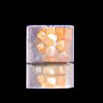
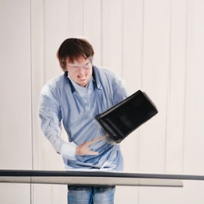

# DALL-3

try it out on colab 
<a href="https://colab.research.google.com/drive/1SlcC0u-tzCrHYL7yYP_DkKu8x0ehXBv0?usp=sharing">
    
</a>
  
DALL-3 is a mashup of DALLE-pytorch, VQGAN and Clip-Guided Diffusion. The basic idea is to use a diffusion model instead of VAE for the decoder stage, which allows us to use 16x16 tokens instead of 32x32 while maintaining comparable image quality.

This DALLE model is meant to be used with https://github.com/Jack000/guided-diffusion

minor modifications to DALLE-pytorch:
- hardcoded 128px image size in dalle (in order to use mismatched VAE/DALLE image sizes)
- added top-p filtering

Cherry picked sample images:

<table>
<tr><th>Before diffusion</th><th>After diffusion</th></tr>
<tr><td></img></td><td></img></td></tr>
<tr><td colspan="2"><sub>Prompt: A cube made of cloud, a cube with the texture of cloud</sub></td></tr>
<tr><td></img></td><td></img></td></tr>
<tr><td colspan="2"><sub>Prompt: A cube made of water, a cube with the texture of water</sub></td></tr>
<tr><td></img></td><td></img></td></tr>
<tr><td colspan="2"><sub>Prompt: A cube made of porcupine, a cube with the texture of porcupine</sub></td></tr>

<tr><td></img></td><td></img></td></tr>
<tr><td colspan="2"><sub>Prompt: An armchair shaped like an avocado, an avocado armchair</sub></td></tr>

<tr><td></img></td><td></img></td></tr>
<tr><td colspan="2"><sub>Prompt: A girl with thick glasses, a girl wearing glasses</sub></td></tr>

<tr><td></img></td><td></img></td></tr>
<tr><td colspan="2"><sub>Prompt: A machine learning researcher smashes his computer in a fit of rage</sub></td></tr>
</table>

Non-Cherry picked images (clip re-ranked best 8 out of 1024):

<table>
<tr><td></img></td><td></img></td><td></img></td><td></img></td></tr>
<tr><td></img></td><td></img></td><td></img></td><td></img></td></tr>
<tr><td colspan="4">A cube made of cloud. A cube with the texture of cloud</td></tr>
</table>

<table>
<tr><td></img></td><td></img></td><td></img></td><td></img></td></tr>
<tr><td></img></td><td></img></td><td></img></td><td></img></td></tr>
<tr><td colspan="4">An armchair shaped like an avocado. An avocado armchair</td></tr>
</table>

<table>
<tr><td></img></td><td></img></td><td></img></td><td></img></td></tr>
<tr><td></img></td><td></img></td><td></img></td><td></img></td></tr>
<tr><td colspan="4">A girl with thick glasses. A girl wearing glasses</td></tr>
</table>

## Usage
```# git clone this repo, then
cd DALLE-pytorch
pip install -e .

# download GumbelVQ VAE model
mkdir -p vqgan_gumbel_f8
wget 'https://heibox.uni-heidelberg.de/f/b24d14998a8d4f19a34f/?dl=1' -O 'vqgan_gumbel_f8/model.yaml' 
wget 'https://heibox.uni-heidelberg.de/f/34a747d5765840b5a99d/?dl=1' -O 'vqgan_gumbel_f8/last.ckpt'

# download DALL-E models
wget https://dall-3.com/models/dalle/bpe.model
wget https://dall-3.com/models/dalle/dalle-latest.pt

# generate (optionally install OpenAI clip for --clip_sort)
python generate.py --top_p 0.85 --temperature 1.0 --clip_sort --output_npy --dalle_path ./dalle-latest.pt --bpe_path bpe.model --taming --vqgan_model_path vqgan_gumbel_f8/last.ckpt --vqgan_config_path vqgan_gumbel_f8/model.yaml --text 'a girl with thick glasses. a girl wearing glasses'

# post process
# use the npy file as input to clip guided diffusion https://github.com/Jack000/guided-diffusion

```

## Citations

```bibtex
@misc{ramesh2021zeroshot,
    title   = {Zero-Shot Text-to-Image Generation}, 
    author  = {Aditya Ramesh and Mikhail Pavlov and Gabriel Goh and Scott Gray and Chelsea Voss and Alec Radford and Mark Chen and Ilya Sutskever},
    year    = {2021},
    eprint  = {2102.12092},
    archivePrefix = {arXiv},
    primaryClass = {cs.CV}
}
```

```bibtex
@misc{unpublished2021clip,
    title  = {CLIP: Connecting Text and Images},
    author = {Alec Radford, Ilya Sutskever, Jong Wook Kim, Gretchen Krueger, Sandhini Agarwal},
    year   = {2021}
}
```

```bibtex
@misc{kitaev2020reformer,
    title   = {Reformer: The Efficient Transformer},
    author  = {Nikita Kitaev and Łukasz Kaiser and Anselm Levskaya},
    year    = {2020},
    eprint  = {2001.04451},
    archivePrefix = {arXiv},
    primaryClass = {cs.LG}
}
```

```bibtex
@misc{esser2021taming,
    title   = {Taming Transformers for High-Resolution Image Synthesis},
    author  = {Patrick Esser and Robin Rombach and Björn Ommer},
    year    = {2021},
    eprint  = {2012.09841},
    archivePrefix = {arXiv},
    primaryClass = {cs.CV}
}
```

```bibtex
@misc{ding2021cogview,
    title   = {CogView: Mastering Text-to-Image Generation via Transformers},
    author  = {Ming Ding and Zhuoyi Yang and Wenyi Hong and Wendi Zheng and Chang Zhou and Da Yin and Junyang Lin and Xu Zou and Zhou Shao and Hongxia Yang and Jie Tang},
    year    = {2021},
    eprint  = {2105.13290},
    archivePrefix = {arXiv},
    primaryClass = {cs.CV}
}
```

```bibtex
@software{peng_bo_2021_5196578,
    author       = {PENG Bo},
    title        = {BlinkDL/RWKV-LM: 0.01},
    month        = {aug},
    year         = {2021},
    publisher    = {Zenodo},
    version      = {0.01},
    doi          = {10.5281/zenodo.5196578},
    url          = {https://doi.org/10.5281/zenodo.5196578}
}
```

```bibtex
@misc{su2021roformer,
    title   = {RoFormer: Enhanced Transformer with Rotary Position Embedding},
    author  = {Jianlin Su and Yu Lu and Shengfeng Pan and Bo Wen and Yunfeng Liu},
    year    = {2021},
    eprint  = {2104.09864},
    archivePrefix = {arXiv},
    primaryClass = {cs.CL}
}
```

*Those who do not want to imitate anything, produce nothing.* - Dali
